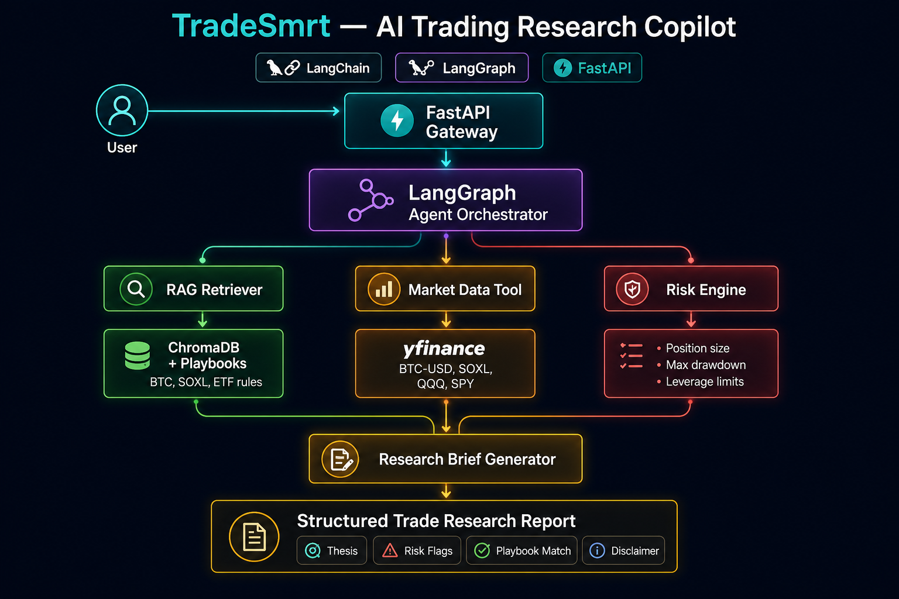
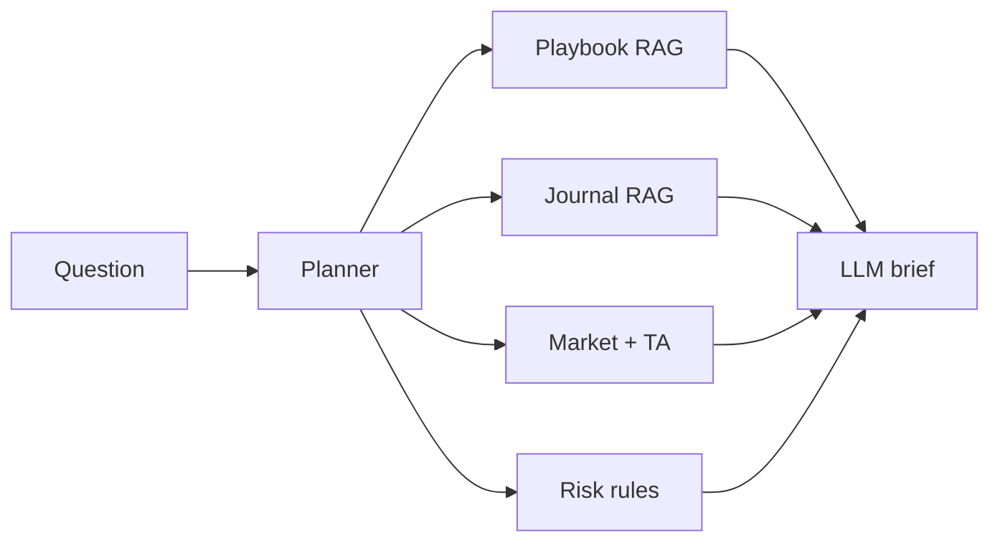

# TradeSmart

**AI trading research copilot for Bitcoin, ETFs, and SOXL**

Ask a trading question → get a structured brief grounded in **your playbooks**, **past trades**, **market data**, **technical indicators**, and **risk rules**.

Not a trading bot. Not financial advice. Pre-trade research only.

---

## See it in action (no install)

### UI preview


*Sample output for illustration. Numbers and thesis are not live market data.*

### Sample run (same scenario, readable text)

<details>
<summary><strong>Click to expand full example output</strong></summary>

**Question**

```text
SOXL ran from ~68 to ~190. I bought 14 @ 188.89 and 20 @ 168.74,
sold 20 @ 166. Should I hold or trim? Compare to my past trades and RSI.
```

**Agent selects tools**

```text
playbook RAG → journal RAG → market → technicals → risk engine → LLM
```

**Thesis**

> Extended rally near 52w highs. Journal shows prior trim at **166** and recent adds at **168.74** / **188.89**. RSI ~78 → consider **partial trim**, not full exit.

| SOXL | Price | 1d | 52w pos |
|------|-------|-----|---------|
| SOXL | $190.56 | +6.8% | 0.97 |
| SMH | $312.40 | +2.1% | 0.91 |

| RSI14 | SMA20 | SMA200 | 60d DD |
|-------|-------|--------|--------|
| 78.2 | 172.4 | 98.6 | -0.8% |

**Journal RAG retrieved**

```text
SELL 20 @ 166.00 — swing exit
BUY  14 @ 188.89 — breakout add
BUY  20 @ 168.74 — pullback add
```

**Risk flags:** extended_price · rsi_overbought · extended_rally

**Action items:** trim 25–40% · trail stop below SMA20 · no new size until RSI cools

</details>

### Try the interactive demo (browser, free)

Deploy on [Streamlit Cloud](https://share.streamlit.io) with main file **`streamlit_app.py`** and **no API key** — runs in sample mode.  
Details: [docs/DEPLOY.md](docs/DEPLOY.md)

More example questions: [docs/EXAMPLE_QUERIES.md](docs/EXAMPLE_QUERIES.md)

---

## What problem it solves

Before entering a BTC / ETF / SOXL trade, you usually check:

1. Does this match **my rules**?
2. What does **market + technical** context look like?
3. Am I repeating a **past pattern** (good or bad)?
4. Am I breaking **risk limits**?

TradeSmart runs that checklist in one agent call.

---

## How it works





| Component | What it does |
|-----------|--------------|
| **Planner** | Picks which tools to run per question |
| **Playbook RAG** | Retrieves your markdown trading rules |
| **Journal RAG** | Retrieves similar past trades |
| **Market + TA** | yfinance + RSI, MACD, SMA, ATR |
| **Risk engine** | Python rules (caps, flags) before LLM |
| **LLM** | Synthesizes thesis + action items |

**Stack:** FastAPI · LangGraph · LangChain · ChromaDB · OpenAI · Streamlit

---

## Run locally

**Full guide:** [docs/SETUP.md](docs/SETUP.md) (Windows / macOS / Docker / troubleshooting)

**Requirements:** Python 3.11+ · OpenAI API key (live mode only)

### Quick start (Windows)

```powershell
git clone https://github.com/yongguncodework/TradeSmart.git
cd TradeSmart
python -m venv .venv
.venv\Scripts\activate
pip install -r requirements.txt

copy .env.example .env          # set OPENAI_API_KEY=sk-...
python scripts/ingest_playbooks.py --rebuild

# Terminal 1 — API
uvicorn app.main:app --reload --host 127.0.0.1 --port 8000

# Terminal 2 — UI
streamlit run streamlit_app.py
```

| URL | What |
|-----|------|
| http://127.0.0.1:8501 | Streamlit UI |
| http://127.0.0.1:8000/docs | API Swagger |

**Sample mode (no API key):** `$env:TRADESMART_MOCK="true"; streamlit run streamlit_app.py`

**Docker:** `docker compose up --build` (see [SETUP.md](docs/SETUP.md))

---

## Customize knowledge base

| Path | Purpose |
|------|---------|
| `data/playbooks/` | Trading rules (BTC, SOXL, ETF, risk) |
| `data/journal/trades.jsonl` | Your trade history for journal RAG |

After edits: `python scripts/ingest_playbooks.py --rebuild`

---

## Tests

```bash
pytest -q
```

---

## Limitations

- yfinance data is not a live broker feed  
- LLM output requires human verification — not for automated trading  
- Sample demo mode returns illustrative output only  

---

## License

MIT — see [LICENSE](LICENSE).

## Disclaimer

Educational / personal research only. Not investment advice. Verify all data independently.
