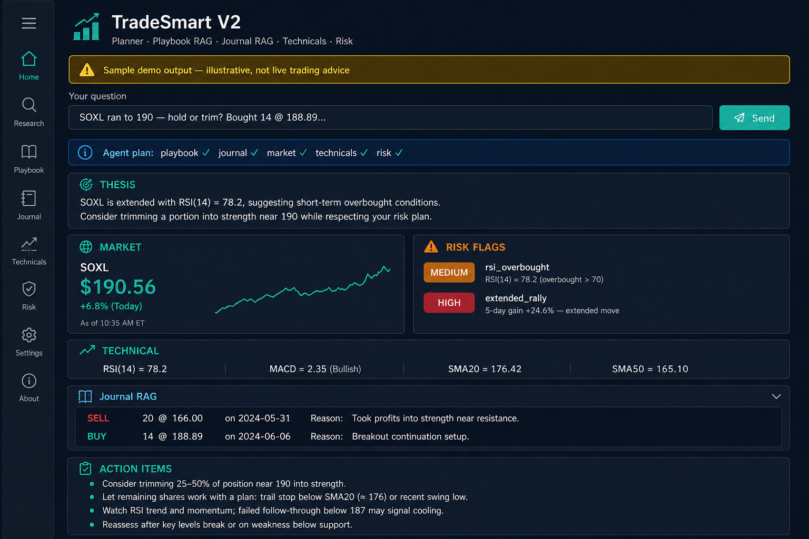

# TradeSmart

**English:** [README](../README.md)

**비트코인·ETF·SOXL 트레이딩 리서치 AI 코파일럿**

트레이딩 질문 → **플레이북**, **과거 매매**, **시장 데이터**, **기술적 지표**, **리스크 규칙**에 근거한 구조화된 브리프.

자동 매매 봇이 아닙니다. 투자 조언이 아닙니다. 매매 전 리서치 전용입니다.

---

## 동작 미리보기 (설치 없이)

### UI 미리보기



*예시 출력입니다. 숫자와 논지는 실시간 시장 데이터가 아닙니다.*

### Streamlit 데모 (브라우저, 무료)

[Streamlit Cloud](https://share.streamlit.io)에 **`streamlit_app.py`** 로 배포하고 **API 키 없이** 샘플 모드로 실행 가능.  
자세히: [DEPLOY.md](DEPLOY.md)

예시 질문: [EXAMPLE_QUERIES.md](EXAMPLE_QUERIES.md)

---

## 로컬 실행

**전체 가이드:** [SETUP.md](SETUP.md)

**요구사항:** Python 3.11+ · OpenAI API 키 (실시간 AI 모드만)

```powershell
git clone https://github.com/yongguncodework/TradeSmart.git
cd TradeSmart
python -m venv .venv
.venv\Scripts\activate
pip install -r requirements.txt

copy .env.example .env          # OPENAI_API_KEY=sk-...
python scripts/ingest_playbooks.py --rebuild

# 터미널 1 — API
uvicorn app.main:app --reload --host 127.0.0.1 --port 8000

# 터미널 2 — UI
streamlit run streamlit_app.py
```

| URL | 설명 |
|-----|------|
| http://127.0.0.1:8501 | Streamlit UI (사이드바 **한국어** 토글) |
| http://127.0.0.1:8000/docs | API Swagger |

**샘플 모드 (API 키 없음):** `$env:TRADESMART_MOCK="true"; streamlit run streamlit_app.py`

---

## 지식 베이스 커스터마이즈

| 경로 | 용도 |
|------|------|
| `data/playbooks/` | 트레이딩 규칙 (BTC, SOXL, ETF, 리스크) |
| `data/journal/trades.jsonl` | 매매일지 RAG용 거래 기록 |

수정 후: `python scripts/ingest_playbooks.py --rebuild`

---

## 면책

교육·개인 리서치 목적입니다. 투자 조언이 아닙니다. 모든 데이터는 직접 확인하세요.

MIT License — [LICENSE](../LICENSE)
